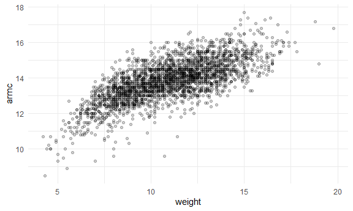
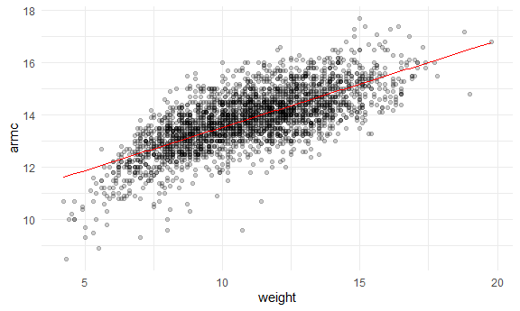
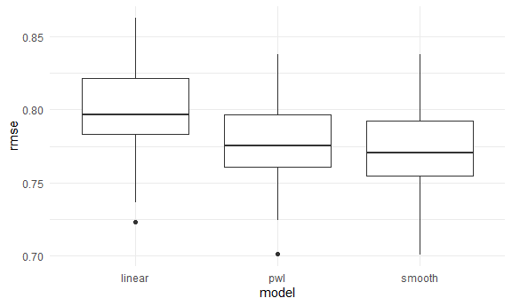

crossvalidation
================
Xuehan Yang
2021/11/18

Although hypothesis tests provide a way to compare nested linear models,
in many situations the approaches under consideration don’t fit nicely
in this paradigm. Indeed, for many modern tools and in many
applications, the emphasis lies on prediction accuracy rather than on
statistical significance. In these cases, cross validation provides a
way to compare the predictive performance of competing methods.

``` r
library(tidyverse)
library(modelr)
library(mgcv)
library(viridis)


knitr::opts_chunk$set(
  fig.width = 6,
  fig.asp = .6,
  out.width = "90%"
)

theme_set(theme_minimal() + theme(legend.position = "bottom"))

options(
  ggplot2.continuous.colour = "viridis",
  ggplot2.continuous.fill = "viridis"
)

scale_colour_discrete = scale_colour_viridis_d
scale_fill_discrete = scale_fill_viridis_d
```

## CV “by hand”

Simulate a dataset

``` r
nonlin_df = 
  tibble(
    id = 1:100,
    x = runif(100, 0, 1),
    y = 1 - 10*(x - 0.3)^2 + rnorm(100, 0, 0.3)
  )

nonlin_df %>% 
  ggplot(aes(x = x, y = y)) + 
  geom_point()
```


Anti\_join to create training dataset.

``` r
train_df = sample_n(nonlin_df, 80)
test_df = anti_join(nonlin_df, train_df, by = "id")

ggplot(train_df, aes(x = x, y = y)) +
  geom_point() +
  geom_point(data = test_df, color = "red")
```


Fit my models.

``` r
linear_mod = lm(y ~ x, data = train_df)
smooth_mod = mgcv::gam(y ~ s(x), data = train_df)
wiggly_mod = mgcv::gam(y ~ s(x, k = 30), sp = 10e-6, data = train_df)
```

Plot the results

``` r
train_df %>% 
  add_predictions(smooth_mod) %>% 
  ggplot(aes(x = x, y = y)) + geom_point() +
  geom_line(aes(y = pred), color = "red")
```


``` r
train_df %>% 
  add_predictions(wiggly_mod) %>% 
  ggplot(aes(x = x, y = y)) + geom_point() +
  geom_line(aes(y = pred), color = "red")
```


``` r
train_df %>% 
  gather_predictions(linear_mod, smooth_mod, wiggly_mod) %>% 
  mutate(model = fct_inorder(model)) %>% 
  ggplot(aes(x = x, y = y)) +
  geom_point() +
  geom_line(aes(y = pred), color = "red") +
  facet_wrap(~model)
```


quantify the results using rmse

``` r
rmse(linear_mod, test_df)
```

    ## [1] 0.8199144

``` r
rmse(smooth_mod, test_df)
```

    ## [1] 0.3763496

``` r
rmse(wiggly_mod, test_df)
```

    ## [1] 0.4530695

## CV using modelr

USe `modelr::crossv_mc`

``` r
cv_df = 
  crossv_mc(nonlin_df, 100) # 100 trainings and tests

cv_df %>% pull(train) %>% .[[1]] %>% as_tibble()
```

    ## # A tibble: 79 x 3
    ##       id      x       y
    ##    <int>  <dbl>   <dbl>
    ##  1     1 0.0383  0.0341
    ##  2     2 0.908  -2.73  
    ##  3     3 0.0768  0.118 
    ##  4     4 0.426   1.30  
    ##  5     5 0.442   0.929 
    ##  6     6 0.886  -2.25  
    ##  7     7 0.430   0.324 
    ##  8     8 0.499   0.338 
    ##  9     9 0.440   0.581 
    ## 10    10 0.306   1.01  
    ## # ... with 69 more rows

``` r
cv_df = 
  crossv_mc(nonlin_df, 100) %>% 
  mutate(
    train = map(train, as_tibble),
    test = map(test, as_tibble)
  )
```

lets fit models

``` r
cv_df = 
  cv_df %>% mutate(
    linear_mod = map(train, ~lm(y~x, data = .x)),
    smooth_mod = map(train, ~mgcv::gam(y~s(x), data = .x)),
    wiggly_mod = map(train, ~gam(y~s(x, k = 30), sp = 10e-6, data = .x))
  ) %>% 
  mutate(
    rmse_linear = map2(linear_mod, test, ~rmse(model = .x, data = .y)),
    rmse_smooth = map2(smooth_mod, test, ~rmse(model = .x, data = .y)),
    rmse_wiggly = map2(wiggly_mod, test, ~rmse(model = .x, data = .y))
  )
```

Look at output

``` r
cv_df %>% 
  select(starts_with("rmse")) %>% 
  unnest() %>% 
  pivot_longer(
    everything(),
    names_to = "model", 
    values_to = "rmse",
    names_prefix = "rmse_") %>% 
  mutate(model = fct_infreq(model)) %>% 
  ggplot(aes(x = model, y = rmse)) + geom_violin()
```


## Child growth data

import data

``` r
child_growth_df = read_csv("cross_validation_files/nepalese_children.csv") %>% 
  mutate(
    weight_cp = (weight > 7)*(weight - 7)
  )
```

``` r
child_growth_df %>% 
  ggplot(aes(x = weight, y = armc)) +
  geom_point(alpha = .2)
```



consider candidate models.

``` r
linear_mod = lm(armc ~ weight, data = child_growth_df)
pwl_mod    = lm(armc ~ weight + weight_cp, data = child_growth_df)
smooth_mod = gam(armc ~ s(weight), data = child_growth_df)
```

``` r
child_growth_df %>% 
  add_predictions(linear_mod) %>% 
  ggplot(aes(x = weight, y = armc)) +
  geom_point(alpha = .2) +
  geom_line(aes(y = pred), color = "red")
```



Use cv to compare models

``` r
cv_df = 
  crossv_mc(child_growth_df, 100) %>% 
  mutate(
    train = map(train, as_tibble),
    test = map(test, as_tibble)
  )
```

Fit models and extract rmse

``` r
cv_df = 
cv_df %>% 
  mutate(
    linear_mod = map(.x = train, ~lm(armc ~ weight, data = .x)),
    pwl_mod    = map(.x = train, ~lm(armc ~ weight + weight_cp, data = .x)),
    smooth_mod = map(.x = train, ~gam(armc ~ s(weight), data = .x))
    ) %>% 
  mutate(
    rmse_linear = map2_dbl(.x = linear_mod, .y = test, ~rmse(data = .y, model = .x)),
    rmse_smooth = map2_dbl(.x = smooth_mod, .y = test, ~rmse(data = .y, model = .x)),
    rmse_pwl = map2_dbl(.x = pwl_mod, .y = test, ~rmse(data = .y, model = .x))
  )
```

Look at RMSE distribution

``` r
cv_df %>% 
  select(.id, starts_with("rmse")) %>% 
  pivot_longer(
    rmse_linear:rmse_pwl,
    names_to = "model",
    values_to = "rmse",
    names_prefix = "rmse_"
  ) %>% 
  ggplot(aes(x = model, y = rmse)) +
  geom_boxplot()
```


